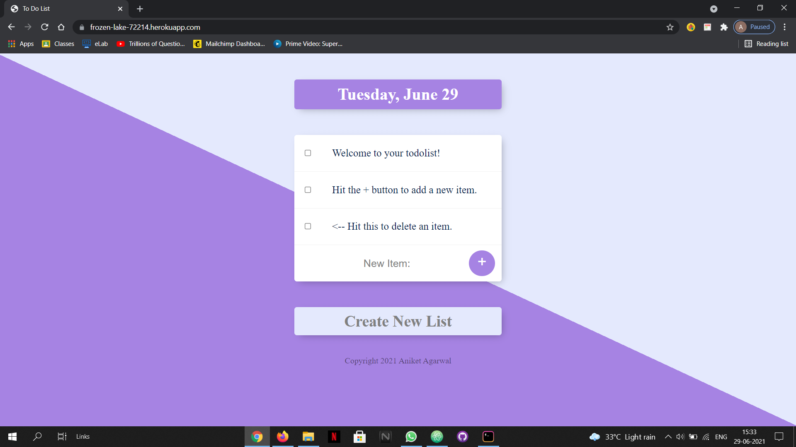

# todolist-app
This is a simple todo list web app for those who wants to keep track of their everyday activities. Users can create more than one list 
for different scenarios. This app is currently generalized for all users i.e, changes done by one user can be viewed by all other users of the app.
# Front-end technologies used:
1. HTML5 
2. CSS3 
3. Bootstrap v4 
# Back-end technologies used:
1. Node.js 
2. Express.js 
3. EJS 
4. MongoDB (database) 
# Build and Run:
1. Download the code in the project directory and install npm packages by command "npm install" on the console after navigating to the project folder.
2. Now open another tab on console and start mongoDB server.
3. Now run the app server on the console by typing "node app.js".
4. Go to localhost:3000 from the chrome browser and the website will be visible.
5. Check out my app through this link --> <a href="https://frozen-lake-72214.herokuapp.com"> My todolist-app</a> 
# Site Preview:

